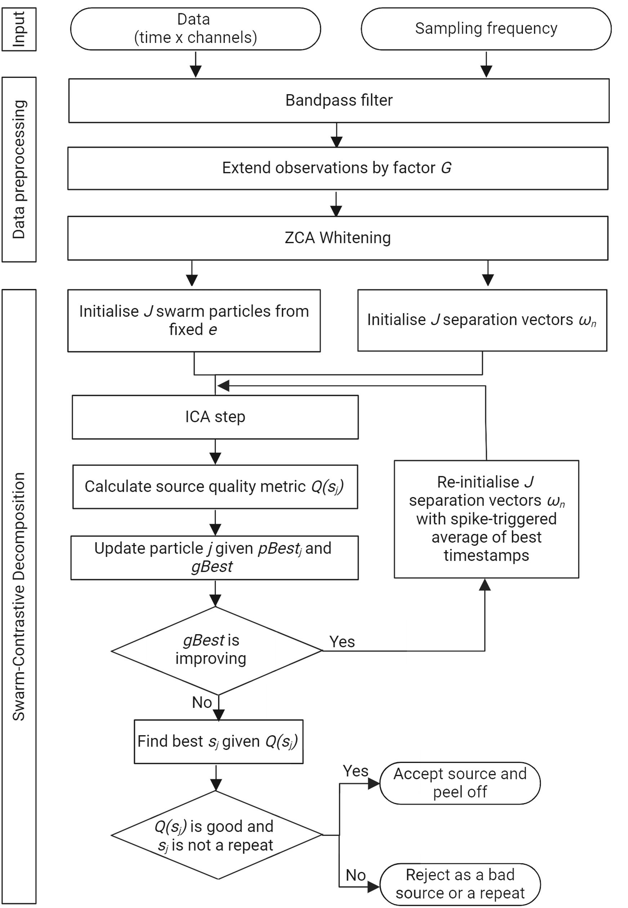

# Swarm-Contrastive Decomposition 🧠

## Overview 📝
Welcome to the Swarm-Contrastive Decomposition project! This repository contains the code of our research paper on decomposition of Neurophysiological Time Series signals. The primary goal of this project is to provide an open-source implementation for fostering further research in this area.
<div align="center">
    
</div>

## Table of Contents 📚
- [Installation](#installation)
- [Quick start](#quickstart)
- [Contributing](#contributing)
- [License](#license)
- [Citation](#citation)
- [Contact](#contact)

## Installation 🛠️

### Prerequisites
Make sure you have the following software and libraries installed:
- Python 3.10 🐍
- NumPy 📦
- PyTorch 🔥

### Steps
Follow these steps to set up the project locally:

1. Clone the repository:
    ```sh
    git clone https://github.com/AgneGris/swarm-contrastive-decomposition
    ```
2. Navigate to the project directory:
    ```sh
    cd swarm-contrastive-decomposition
    ```
3. Create the conda environment from the `decomposition.yml` file:
    ```sh
    conda env create -f decomposition.yml
    ```
4. Activate the environment:
    ```sh
    conda activate decomposition
    ```

## Quick start 🚀
Upload your input data in the ``` data\input ``` folder. 
Depending on your data structure, you will need to modify the data loading in ``` main.py ``` (lines 41-53). Once your data is correctly loaded, 
run ``` python main.py ``` to decompose your data. 

## Contributing 🤝
We welcome contributions! Here’s how you can contribute:

1. Fork the repository.
2. Create a feature branch (git checkout -b feature/newfeature).
3. Commit your changes (git commit -m 'Add some newfeature').
4. Push to the branch (git push origin feature/newfeature).
5. Open a pull request.

## License 📜
This project is licensed under the CC BY-NC 4.0 License.

## Citation

If you use this code in your research, please cite our paper:

```sh
@article{grison2024,
  title={A Particle Swarm Optimised Independence Estimator for Blind Source Separation of Neurophysiological Time Series},
  author={Agnese Grison, Alexander Kenneth Clarke, Silvia Muceli, Jaime Ibanez, Aritra Kundu, Dario Farina},
  journal={IEEE Transactions on Biomedical Engineering},
  year={2024},
  volume={Volume},
  pages={Page numbers},
  publisher={Publisher}
}

```

## Contact

For any questions or inquiries, please contact us at:
```sh
Agnese Grison
agnese.grison@outlook.it
```