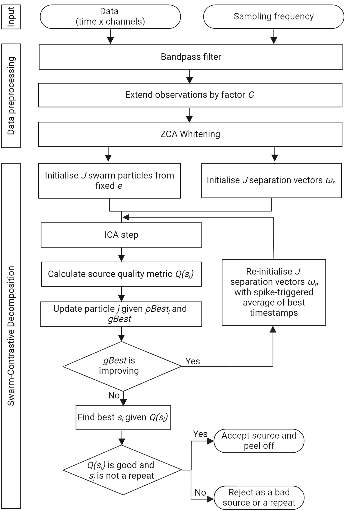

# Swarm-Contrastive Decomposition 🧠

## Overview 📝
Welcome to the Swarm-Contrastive Decomposition project! This repository contains the code of our research paper on decomposition of Neurophysiological Time Series signals. The primary goal of this project is to provide an open-source implementation for fostering further research in this area.
<div align="center">
    
</div>

## Table of Contents 📚
- [Installation](#installation)
- [How to use this repository](#howtousetherepo)
- [Contributing](#contributing)
- [License](#license)
- [Citation](#citation)
- [Contact](#contact)

## Installation 🛠️

### Prerequisites
Make sure you have the following software and libraries installed:
- Python 3.10 🐍
- NumPy 📦
- PyTorch 🔥

### Steps
Follow these steps to set up the project locally:

1. Clone the repository:
    ```sh
    git clone https://github.com/AgneGris/swarm-contrastive-decomposition
    ```
2. Navigate to the project directory:
    ```sh
    cd swarm-contrastive-decomposition
    ```
3. Create the conda environment from the `decomposition.yml` file:
    ```sh
    conda env create -f decomposition.yml
    ```
4. Activate the environment:
    ```sh
    conda activate decomposition
    ```

## How to use this repository 🚀
1. **Upload Your Input Data:**
   - Place your input data files in the `data/input` folder.

2. **Modify Data Loading:**
   - Depending on your data structure, you may need to adjust the data loading logic in `main.py` (lines 41-53).

3. **Configure the Parameters:**
   - Customize the configuration settings in `main.py` according to your needs:
     - **`device`**: Set to `"cuda"` for GPU or `"cpu"` for CPU.
     - **`acceptance_silhouette`**: Define the acceptance threshold for source quality.
     - **`extension_factor`**: This factor typically equals `1000 / number of channels`. A higher value may improve results.
     - **`low_pass_cutoff`**: Define the cutoff frequency for the low-pass filter.
     - **`high_pass_cutoff`**: Define the cutoff frequency for the high-pass filter.
     - **`start_time`**: Set the start time for signal trimming. Use `0` to include the entire signal from the beginning.
     - **`end_time`**: Set the end time for signal trimming. Use `-1` to include the entire signal until the end.
     - **`max_iterations`**: Specify the maximum number of iterations for the decomposition process.
     - **`sampling_frequency`**: Indicate the sampling frequency of your signal.
     - **`peel_off_window_size`**: Define the size of the window (in ms) for the spike-triggered average of the source.
     - **`output_final_source_plot`**: Set to `True` to generate a plot of the final source, or `False` to skip plotting.
     - **`use_coeff_var_fitness`**: Set to `True` if consistent activity is expected in discharge times (recommended for most EMGs); set to `False` for other types of data (e.g., intracortical).
     - **`remove_bad_fr`**: Set to `True` to filter out sources with firing rates below 2 Hz or above 100 Hz. You can adjust these thresholds in `models\scd.py` if needed.
   - Other configuration parameters are found in `config\structures`. 

4. **Run the Decomposition:**
   - Once your data is properly loaded and configured, run the following command to start the decomposition process:
     ```bash
     python main.py
     ``` 
   - Once the decomposition process has terminated, the output data will be saved in the `data/output` folder.

## Contributing 🤝
We welcome contributions! Here’s how you can contribute:

1. Fork the repository.
2. Create a feature branch (git checkout -b feature/newfeature).
3. Commit your changes (git commit -m 'Add some newfeature').
4. Push to the branch (git push origin feature/newfeature).
5. Open a pull request.

## License 📜
This project is licensed under the CC BY-NC 4.0 License.

## Citation

If you use this code in your research, please cite our paper:

```sh
@article{10643350,
  author={Grison, Agnese and Clarke, Alexander Kenneth and Muceli, Silvia and Ibáñez, Jaime and Kundu, Aritra and Farina, Dario},
  journal={IEEE Transactions on Biomedical Engineering}, 
  title={A Particle Swarm Optimised Independence Estimator for Blind Source Separation of Neurophysiological Time Series}, 
  year={2024},
  volume={},
  number={},
  pages={1-11},
  keywords={Recording;Time series analysis;Sorting;Vectors;Measurement;Electrodes;Probes;Independent component analysis;particle swarm optimisation;blind source separation;intramuscular electromyography;intracortical recording},
  doi={10.1109/TBME.2024.3446806}}

```

## Contact

For any questions or inquiries, please contact us at:
```sh
Agnese Grison
agnese.grison16@imperial.ac.uk
```